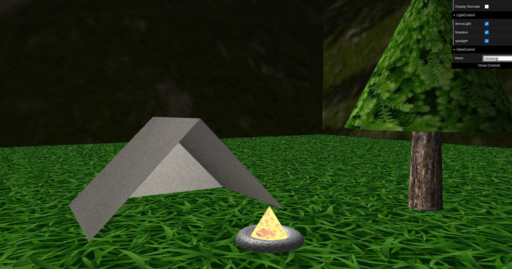

# SGI 2022/2023 - TP1

## Group: T01G03

| Name             | Number    | E-Mail             |
| ---------------- | --------- | ------------------ |
| António Ribeiro         | 201906761 | up201906761@edu.fe.up.pt|
| Pedro Pinheiro         | 201906788 | up201906788@edu.fe.up.pt|

----

## Project information

### Scene

- Our scene portrays a camping scenario deep in the forest, composed by trees, a tent and a campfire.
- [Scene](tp1/scenes/SGI_TP1_XML_T01_G03_v01.xml)
- To create the tent we used rectamgles and triangles.
- For the trees we chose to use cylinders for the trunks and cones (and a sphere) for the leaves. 
- When it comes to the campfire, a torus was used to represent the rocks used to contain the fire,
  and a cylinder was used to represent the fire itself.
- The floor and the skybox are squares/rectangles scaled up. 
- We tried to structure our scene in a way that it would be easy to increment its complexity,
  and the file size would not be too big.
- [Screenshots](tp1/screenshots)

### Technical information

- Parsing encompasses all the rules given by the project statement and extra rules were added for violations. 
- Restrictions were set in place for the sxs grammar (e.g. at least a perspective/transformation, correct values for certain attributes - positive stack number,
ids in the tree, missing attributes), terminating the program if they are not met.
- Other, more specific error conditions that could develop into runtime errors or problems
were also in place (e.g. recursive component references, invalid references, invalid primitive definitions - degenerate triangles etc.)
- If an error from a definition does not corrupt the overall scene, the program will continue to run,
but an alert will appear (e.g. lenght_s/t defined for an inherit/none texture, or multiple attenuation's components set to 1.0). 
- For the appearance and texture updates we opted to use two stacks to keep track of components' information
(operations are much simpler to understand, and to include since they resemble transformations).
- For the GUI we included the obligatory buttons and three others for scene debugging and technical analysis (show/hide axis, light visibility, show/hide normals).

----

## Issues/Problems

- Despite our effort to maintain a good structure (that would easily cascade), the scene file is still quite messy.
- OrthoCamera selection for the scene was quite difficult to think of, in order to keep the scene non-distorted in the viewport.
- We still haven't figured out how to correctly map and update textures coordinates for quadratic surfaces (e.g. torus).
We found this [link](https://gamedev.stackexchange.com/questions/197931/how-can-i-correctly-map-a-texture-onto-a-sphere) that could prove useful.
- Memory consumption from the CGF cloning. In order to reuse the Appearence added previously, we need to ensure its immutability,
for inherit scenarios and recursive path, so a "cloning" step (creating a new CGFApearance with the same attributes) is necessary.
- Problems arose when trying to implement texture inheritance with appearence.apply(). 
Since we couldn't maintain a record of the textures already applied and the JS language works with references/pointers, 
the textures in each appearance were often set to null or rewritten, but we managed to solve them using two stacks.
A solution could be to forcibly add an inner stack into the CGFappearance class, but we didn't want to modify the CGF code.
- KeyM: latency of response when pressing keys.

## Possible future additions

- Hammock using a mesh (possibly with swing animation)
- Inner tent: a bed, lamp and a table etc
- River with moving shader
- Birds flying
