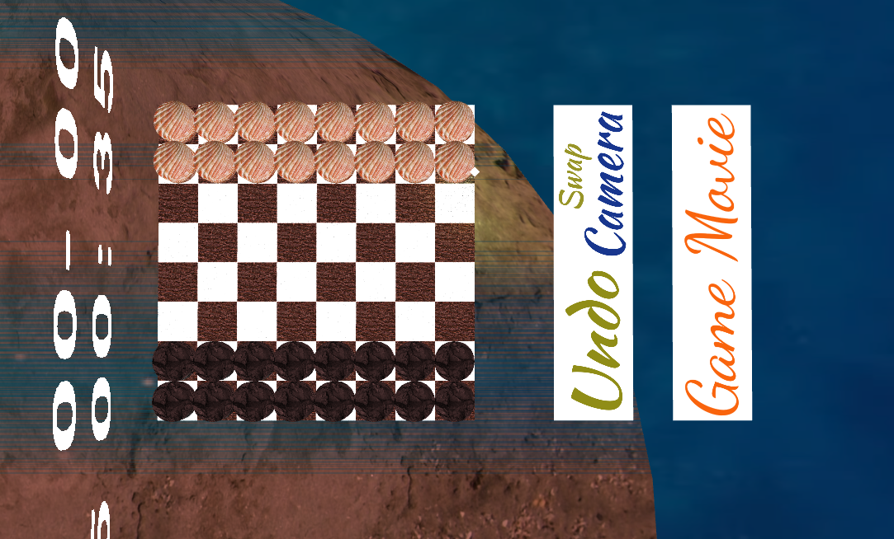

# SGI 2022/2023 - TP2

## Group: T01G03

| Name             | Number    | E-Mail             |
| ---------------- | --------- | ------------------ |
| António Ribeiro         | 201906761 | up201906761@edu.fe.up.pt|
| Pedro Pinheiro         | 201906788 | up201906788@edu.fe.up.pt|


----
## Project information

- The project consists of a checkers game, with player vs player methodology.
- The game is played on a 8x8 board, with 12 pieces for each player.
- It follows the regular rules of checkers, that can be found [here](https://www.ultraboardgames.com/checkers/game-rules.php).

### Scene 

As mentioned, the game as a change scene feature (in the dat GUI, in the upper right corner).

Three environments are available:
- A camping scene (the one used for the previous project's deliveries). 
- A beach scene. 
- A disco bar scene.

These change the overall elements of the surroundings as well as the board and pieces themselves.

- [Screenshots](tp3/screenshots)





A new xml tag, the <board> was added to the new scene files: 

Textures/materials ordering for customization: 
1. black squares 
2. white squares
3. black pieces
4. white pieces
5. black kings
6. white kings
7. board 
8. highlighted square 
9. timer 
10. undo 
11. change camera 
12. game movie 


```xml
<board>
    <size x="X" y="Y" z="Z"/>
    <offset x="X"/>
    <materials>
        .... Materials' id 
        
    </materials>
    <textures>
        .... Textures' id (and s, t coordinates)
    </textures>
</board>
```

The new object had to be included in the MySceneGraph parsing in order to be appended to the appropriate graph.
The board comprises a collection of rectangular patches (affected by the board's size and a predetermined offset), each with a different material and texture.
The pieces are cylinders with circle tops. 


### Technical information

- The following aspects of the guidelines were implemented:
    - An interactive board and pieces (with the CGFlib picking system), allowing to select the complete move of the game.
    - Game piece movements, for both the capturing/moving piece, and the captured pieces, which are stacked alongside the board.
    - A selection spotlight, that directs the player's attention to the selected piece.
    - A game timer, that counts the time of each player and the complete game (shown as a sprite texture), and applies restrictions to each turn.
    - A scoreboard count, that shows the number of captures/points of each player (shown as a sprite texture).
    - The undo possibility (by clicking the respective button) that reverts the last move of the game (and its side effects).
    - A game movie (a stored sequence of moves) that can be replayed at any time (by clicking the respective button).
    - Several cameras, that exchange fluidly.
    - Scene changes, that allow the players to choose the environment of the game (in the GUI corner).

We started from the initial code provided by the teachers (adding the picking availability). 
In terms of architecture, we tried our best to replicate (or at least adapt) the MVC pattern for ease of use.
- The Model includes all memory storage of the game state (board, scores, time...) and logic (movements, invalid moves, capturing...).
- The View is in charge of how the visual elements are created from the available primitives/components, besides showing the current game state (drawing the board and pieces, the timer ...) and animations.
- The Controller is the picking management in the XMLScene class, that calls GameLogic methods as necessary.

Offnote: for a new scene inclusion the main.js file has to be modified accordingly: 
```js
const files = {
        "camping": "SGI_TP1_XML_T01_G03_v03.xml",
        "beach": "beach.xml",
        "newScene": "newScene.xml"
    }
```


----
## Issues/Problems

- Performance decrease is definitely an issue, it began to look evident in the 2nd milestone,
and now with interactive elements it is even more noticeable.
- There was no obvious and "clean" way to structure the architecture of the game. 
- The game logic of the checkers, was difficult to implement (forcing captures, multiple available captures, end conditions...) leading to a complicated section of code.
- We had some doubts on how to balance the OOP and "pure" JS code implementations, taking the latter as the best approach for the board, in terms of performance tradeoff.
- The provided bare-bones structure of the project had some issues, that may have placed setbacks along the way, however we circumvented them.